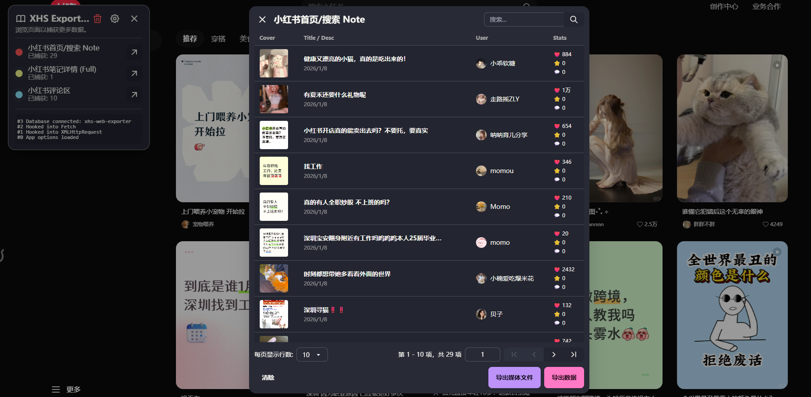
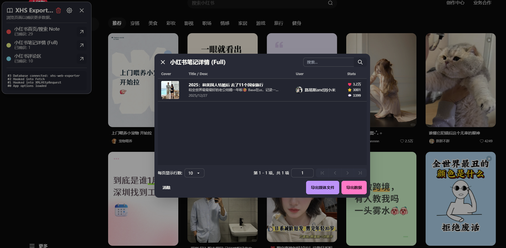
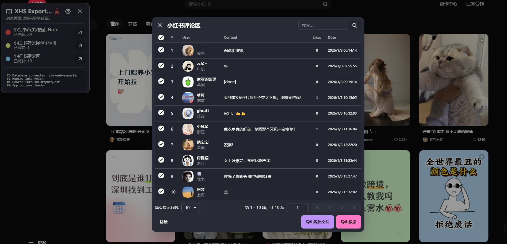

# XHS Web Exporter

小红书油泼猴插件

**Export notes, comments and much more from Xiaohongshu (Little Red Book) web app.**

## Features

- 🚚 Export notes from Home Feed and Search Results as JSON/CSV/HTML
- 📝 Export full note details (including full text description and stats)
- 💬 Export comments from note detail pages
- 🔍 Capture data while you browse
- 🚀 No developer account or API key required
- 🛠️ Ship as a UserScript and everything is done in your browser
- 💾 Your data never leaves your computer
- 💚 Completely free and open-source

## Installation

1. Install the browser extension [Tampermonkey](https://www.tampermonkey.net/) or [Violentmonkey](https://violentmonkey.github.io/)
2. Click [HERE](https://github.com/xiaoyihao001018/xhs-web-exporter/releases/latest/download/xhs-web-exporter.user.js) to install the user script
